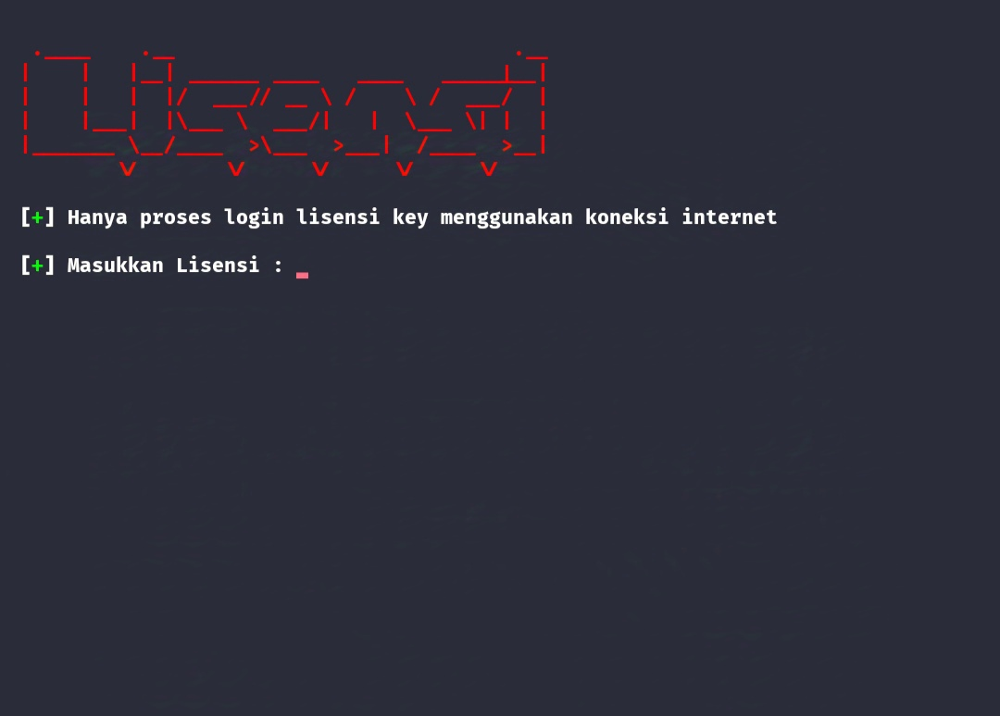
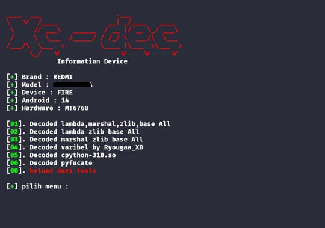

# Decoded python-311 Simpel
 
- Tools decoded by danz-Xc
- tools ini untuk mendecoded file
  semacam lambda marshal zlib base dll
- support decoded cpython-310.so
- support decoded varibel,pyfucate
- untuk versi cpython-311.so coming soon

- Install Module pkg in termux:
  
      pkg update && pkg upgrade
      pkg install tur-repo
      pkg install python3.11
      pkg install git

- Install Module pip in termux:

      pip3.11 install rich
      pip3.11 install getpass
      pip3.11 install requests
      pip3.11 install autopep8
      pip3.11 install subprocess
      pip3.11 install webbrowser
  
- Install pycdc python-311
  
      cp pycdc /data/data/com.termux/files/usr/
      chmod 777 /data/data/com.termux/files/usr/bin/pycdc3
  
- Running tools in termux:

      git clone https://github.com/Da-nz-xc/Decoded
      cd Decoded
      python3.11 decoded.py

# 🔐 Bentuk dalam lisensi key
  
 

  

- Untuk memasukan lisensi key bagi para pengguna

# 🚀 Bentuk dalam menu decoded

 

  

- untuk decoded bermacam fiktur deoeded belum support decoded layers marshal lambda

# Fiktur in tools

1. Decoded lambda,marshal,zlib,base All
2. Decoded lambda zlib base All
3. Decoded marshal zlib base All
4. Decoded varibel by Ryougaa_XD
5. Decoded cpython-310.so
6. Decoded pyfucate

# Hubingi saya jika ada kesalahan
- WhatsApp: https://wa.me/6283170597744
